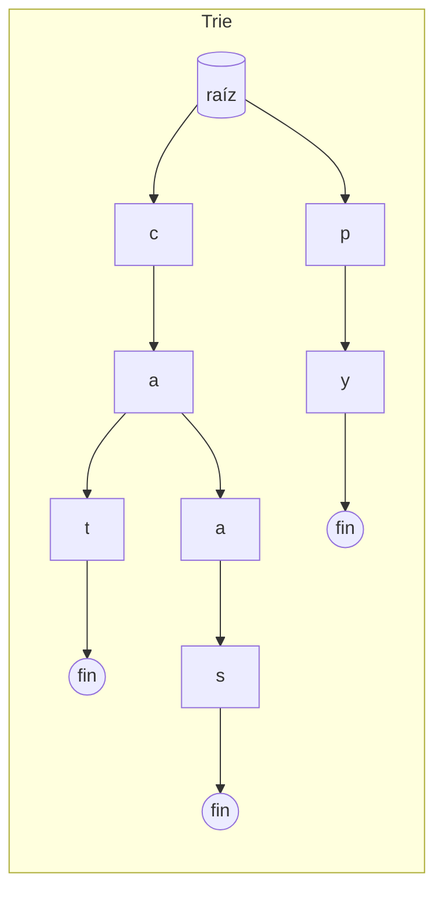
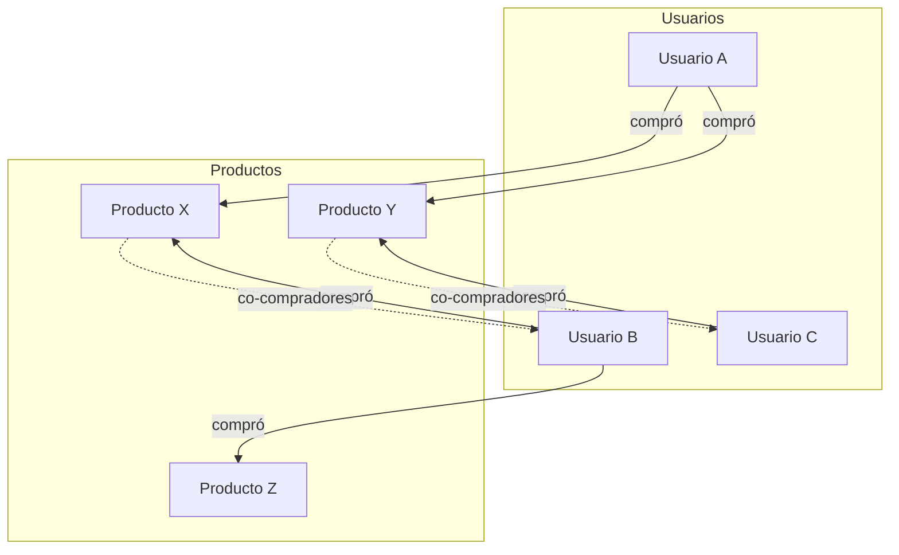

# Tarea 1 de Lenguajes de programación y transducción

Implementación de tres problemas: navegador web, autocompletado y recomendador de productos.

---

## Problema 1: Sistema de navegación de páginas web

### Diagrama de flujo

```mermaid
flowchart TD
    A[Inicio] --> B{Operación}
    B -->|loadPage(url)| C[¿Hay página actual?]
    C -->|Sí| D[Poner actual en pila back]
    C -->|No| E[Vaciar pila forward]
    D --> E
    E --> F[Actual = url]
    F --> G[Fin]

    B -->|goBack| H{¿Hay páginas en back?}
    H -->|No| I[Retornar None]
    H -->|Sí| J[Poner actual en pila forward]
    J --> K[Actual = pop de back]
    K --> G

    B -->|goForward| L{¿Hay páginas en forward?}
    L -->|No| I
    L -->|Sí| M[Poner actual en pila back]
    M --> N[Actual = pop de forward]
    N --> G
```

### Métodos

| Método | Descripción |
|--------|-------------|
| `loadPage(url)` | Carga una página; la actual pasa al historial "atrás" y se limpia "adelante". |
| `goBack()` | Vuelve a la página anterior. Retorna la URL o `None` si no hay. |
| `goForward()` | Avanza a la página siguiente. Retorna la URL o `None` si no hay. |

### Uso

```python
from problema1_navegador import WebBrowser

nav = WebBrowser()
nav.loadPage("https://google.com")
nav.loadPage("https://python.org")
nav.goBack()   # -> "https://google.com"
nav.goForward()  # -> "https://python.org"
nav.goBack()
nav.goBack()   # -> None (no hay más atrás)
```

---

## Problema 2: Función de autocompletar

### Diagrama de diseño (Trie)



Estructura: cada nodo tiene hijos por letra; el nodo marcado como "fin" indica que existe una palabra hasta ahí. Búsqueda por prefijo: bajar por el prefijo y luego recorrer el subárbol para recoger todas las palabras.

### Métodos

| Método | Descripción |
|--------|-------------|
| `insert(word)` | Añade una palabra al diccionario. |
| `autocomplete(prefix)` | Devuelve la lista de palabras que empiezan por `prefix`. |

### Eficiencia

- **Inserción**: O(m), con m = longitud de la palabra.
- **Autocompletado**: O(m + k), con m = longitud del prefijo y k = número de palabras que coinciden.

### Uso

```python
from problema2_autocomplete import Autocomplete

ac = Autocomplete()
ac.insert("casa")
ac.insert("casamiento")
ac.insert("python")
ac.autocomplete("cas")   # -> ["casa", "casamiento"]
ac.autocomplete("py")    # -> ["python"]
```

---

## Problema 3: Sistema de recomendación de productos

### Diagrama: usuarios y productos



Lógica: si el usuario A compró X, se buscan otros usuarios que también compraron X; de ellos se toman los productos que compraron (excluyendo los que A ya tiene) y se recomiendan por frecuencia.

### Métodos

| Método | Descripción |
|--------|-------------|
| `addPurchase(usuario, producto)` | Registra que el usuario compró el producto. |
| `getRecommendations(usuario)` | Devuelve productos recomendados ("quien compró X también compró Y"). |

### Uso

```python
from problema3_recomendador import ProductRecommender

rec = ProductRecommender()
rec.addPurchase("Ana", "Libro A")
rec.addPurchase("Ana", "Libro B")
rec.addPurchase("Bob", "Libro A")
rec.addPurchase("Bob", "Libro C")
rec.getRecommendations("Ana")   # Incluye "Libro C" (Bob compró A y C)
```

---

## Ejecutar tests

```bash
python -m pytest test/ -v
```

O por problema:

```bash
python -m pytest test/test_p1.py -v
python -m pytest test/test_p2.py -v
python -m pytest test/test_p3.py -v
```
